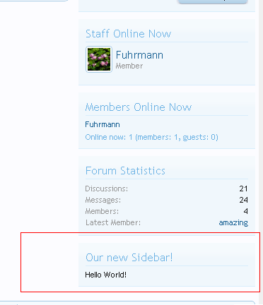
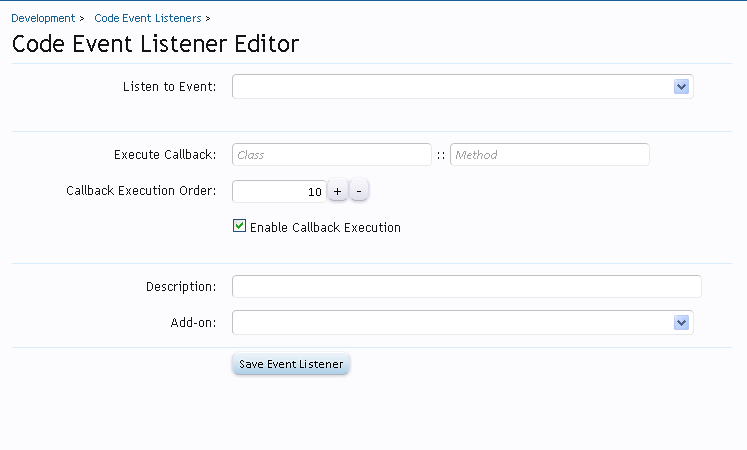
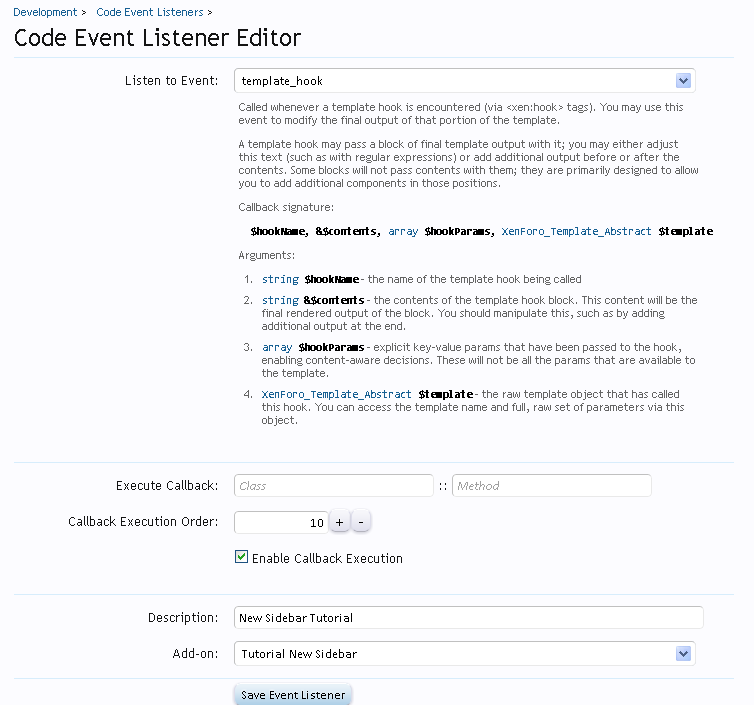
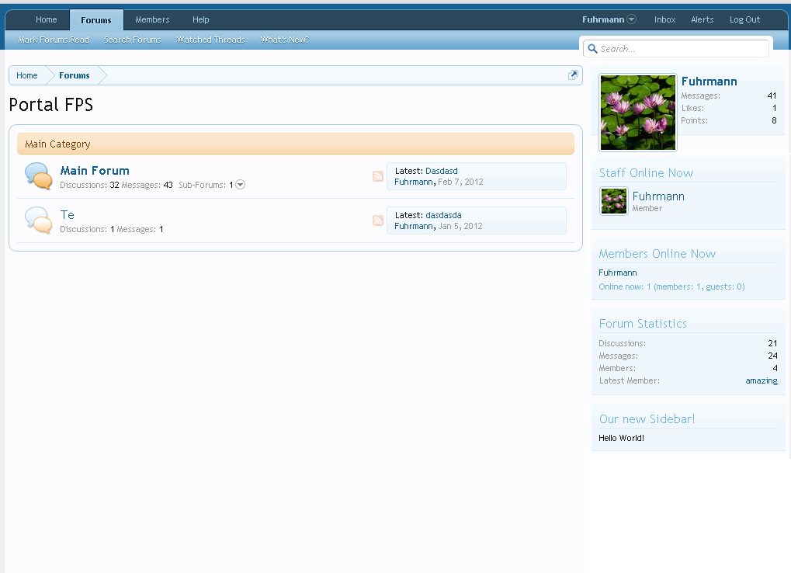

### How to add a new sidebar in the forum list
###### 2012-02-15 17:11

In this tutorial I will show you how to add a new sidebar with your own custom content in the forum list page.

This is what the final result will look like:



<!--more-->

This tutorial consists of 4 steps:

- [Step 1 - Creating the Add-on](#step_1__creating_the_addon)
- [Step 2 - The template](#step_2__the_template)
- [Step 3 - Where do I insert the sidebar?](#step_3__where_do_i_insert_the_sidebar)
- [Step 4 - The listener](#step_4__the_listener)


### <a name="step_1__creating_the_addon"></a>Step 1 - Creating the Add-on

First we need to create a new add-on. This is simple enough to do, but first you will need to be in Debug Mode. You can put your forum in Debug Mode by following the steps here: [link](http://xenforo.com/community/threads/frequently-asked-questions.5183/#post-248490).

To create a new add-on go to **AdminCP -> Home -> List Add-ons** and click in the button **Create Add-on**. In the following screen you need to fill in the fields with the following info:

- **Add-on ID**: NewSidebar
- **Title**: Tutorial New Sidebar
- **Add-on is active**: Checked
- **Version String**: 1.0.0
- **Version ID**: 1

Leave the rest of the fields blank. This add-on is just simple add-on, so there's nothing else to add here. Click Save Add-on and your add-on is created!

Before continuing, let's create our folder and the necessary file. Go to `your_xenforo_root/library` and create a new folder, naming it `NewSidebar`. Inside this folder, create a file called: `Listener.php`.

### <a name="step_2__the_template"></a>Step 2 - The template

We now need to create the template that will hold our content that we want to display in the sidebar. You can put whatever you want in the template, but for this tutorial we'll just add the text "Hello World". To create a new template, go to **AdminCP -> Appearance -> Templates** and hit the **+Create new Template** button.

You can copy and paste the following into the template editor:

**Template name**: *newsidebar_sidebar*

```html
<div class="section">
    <div class="secondaryContent">
        <div class="visitorText">
            <h3>Our new Sidebar!</h3>
            <div class="stats">
                Hello World!
            </div>
        </div>
    </div>
</div>
```

Save. Done, our template is ready to be used in the sidebar.

### <a name="step_3__where_do_i_insert_the_sidebar"></a>Step 3 - Where do I insert the sidebar?

XenForo has a great template hook system. If you are not familiar with it, take a look at this [video tutorial made by Kier](http://xenforo.com/community/threads/how-to-use-template-hooks.13167/).

After seeing the video, you should now be familiar with the template hook system (I hope!). Next, we need to find which hook to use to insert our sidebar - we want one so that we can insert it right after the default XenForo sidebar in the forum list page.

To do that, we need to take a look at the template **forum_list**. You can search for it by going to **AdminCP -> Appearance -> Search Templates** and in the box **Title Contains** enter *forum_list* and hit search.

You'll be presented with just a single result, which is the template we're looking for. Open the template and have a look at the code. See if you find any template hooks.

(take your time)

....


Ok! Found any? I've found what we want:

```html
<xen:hook name="forum_list_sidebar">
```

This is the hook right before where the forum list sidebar starts. So now we will use an event listener to insert some custom content in there. Please, take a note of the hook name (in bold) we will use it later.

### <a name="step_4__the_listener"></a>Step 4 - The listener

To create a new code event listener go to **AdminCP -> Development -> Code Event Listeners** and hit the **+Create New Code Event Listener** button and you will get this:



Fill with the following information:

- **Listen to event**: template_hook
- **Execute CallBack**: do not fill anything, we'll create one
- **Callback Execution Order**: 10
- **Enable Callback Execution**: checked
- **Description**: New Sidebar Tutorial
- **Add-on**: Tutorial New Sidebar

Try to save it and you'll get an error. That's because we haven't created our callback class and method yet.

Leave the Code Event Listener page **OPEN** and let's create our callback class.

Remember at the begining of this tutorial that we created a folder and a file? Well, now we need to go there and open the `Listener.php` file.

If you don't remember, it is in: `xenforo_root/library/NewSidebar`. 

With the file opened, paste in the following code:

```php
<?php
/**
* This is our callback class.
* We must define a callback class to be used in the code event listener.
*/
class NewSidebar_Listener
{
    /**
    * This is our callback method. It uses 4 params. This method will check if the current requested hook is what we want ('forum_list_sidebar')
    * and if it is, we will insert in the contents our template. This way we will have a sidebar right after the XenForo default sidebar.
    *
    */
    public static function templateHook($hookName, &$contents, array $hookParams, XenForo_Template_Abstract $template)
    {
        /* If this hook is what we want! Remember: we have found the hook name when we was looking in the forum_list template! */
        if ($hookName == 'forum_list_sidebar')
        {
            /* Insert our template in the contents. This way our sidebar will be inserted right after the last XenForo sidebar in the forum list page */
            $contents .= $template->create('newsidebar_sidebar');

            /* If you want that our sidebar be BEFORE the XenForo sidebars uncomment the following line (don't forget to comment the line above) */
            //$contents = $template->create('newsidebar_sidebar') . $contents;
        }
    }
}
?>
```

> (please, take a look at the comments, all code is explained in there, it is important to you know what you are doing)

Ok. We now have our callback class and callback method:

```php
NewSidebar_Listener::templateHook
```

Go back to the page where you were before, the code event listeners page. If you left the page open you should have this:



So, now, fill in Execute Callback with the information we've got:

- **Class**: NewSidebar_Listener
- **Method**: templateHook

Save it!

Go to your forum list page when your result should hopefully be this:


