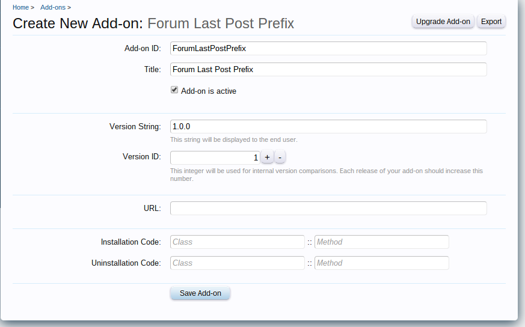
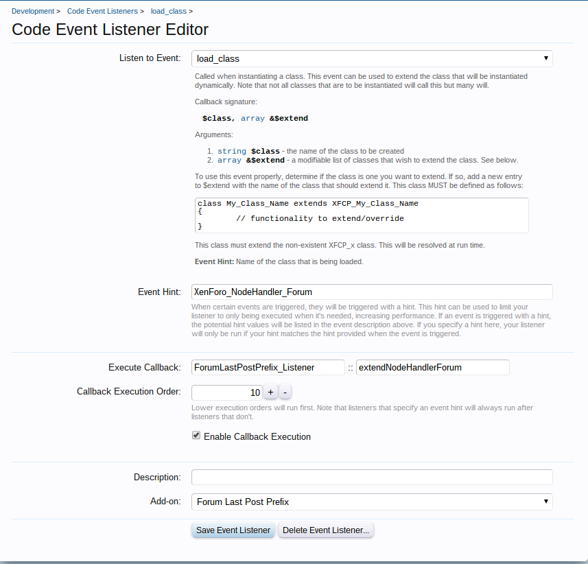
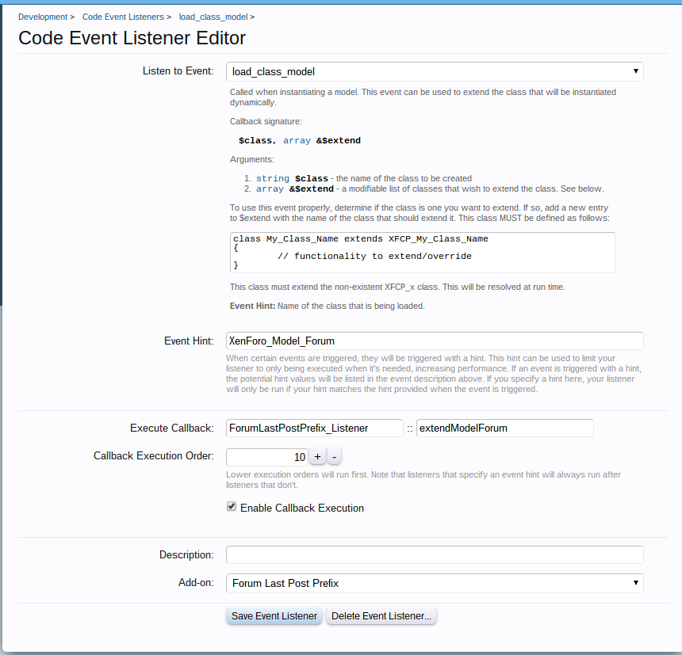
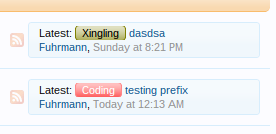
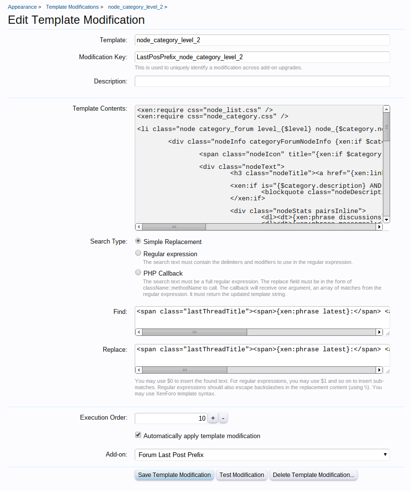
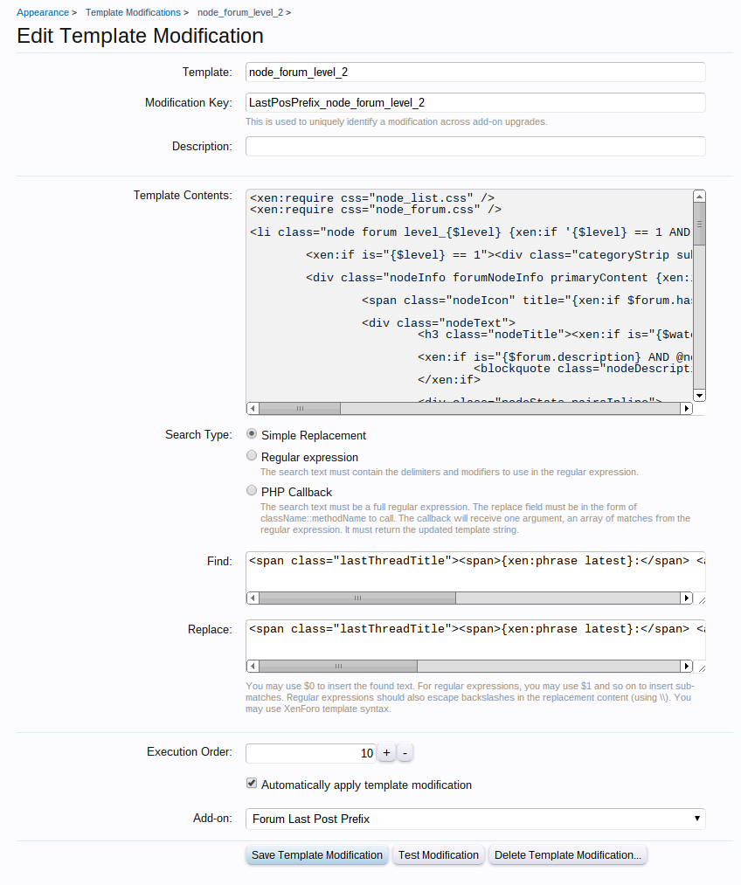

### How to add the last post prefix to forum list
###### 2014-02-25 20:35

In this tutorial I will show you how to add the prefix of the last post onto the forum list, as per this image:


## Steps

This tutorial consists of 5, easy to follow steps:

- [Step 1 - Creating the Add-on](#step_1__creating_the_addon)
- [Step 2 - Understanding what we'll do](#step_2__understanding_what_we_ll_do)
- [Step 3 - Creating the Listener](#step_3__creating_the_listener)
- [Step 4 - Creating the classes](#step_4__creating_the_classes)
- [Step 5 - Creating the Template Modifications](#step_5__creating_the_template_modifications)

### <a name="step_1__creating_the_addon"></a>Step 1 - Creating the Add-on

Let's start by creating a new add-on. This is easy enough to do, but first you need to enable Debug Mode. To do this, simply open up your *library/config.php* file, and add `$config['debug'] = true;` to it.

Now to create a new add-on, go to **AdminCP -> Home -> List Add-ons** and click on **Create Add-on**. Here, fill out the fields as follows:

- **Add-on ID**: ForumLastPostPrefix
- **Title**: Forum Last Post Prefix
- **Add-on is active**: Checked
- **Version String**: 1.0.0
- **Version ID**: 1

Leave the rest of the fields blank. This is what you should end up with:



Click Save Add-on and your add-on is created!

### <a name="step_2__understanding_what_we_ll_do"></a>Step 2 - Understanding what we'll do

In the `xf_forum` table, we have the following columns:

`last_post_id` => The ID of the last post in that forum  
`last_post_date` => The date of the last post in that forum  
`last_post_user_id` => The ID of the last user who posted in that forum  
`last_post_username` => The username of the user who posted in that forum  
`last_thread_title` => The title of the last thread of that forum

That's it. There are no more columns relating to the 'last' post in the forum. So, how do are we going to take the prefix of the last post? Well, it's pretty simple actually.

The prefix information that we want is in another table called `xf_thread`. It is here where all the information regarding threads is recorded, including the `prefix_id` of each thread. This means that we will have to, in someway,  get info from this table. But how?

Let's first figure out how Xenforo works. For every visit to the forum list pages, XenForo calls a function called `getExtraDataForNodes`. This function gets the extra, node-type-specified data for the list of nodes. In this case, the node is a forum. This function is at the following path: `xenforo_root/library/XenForo/NodeHandler/Forum.php`, line 80. Here's a look at the code:

```php
public function getExtraDataForNodes(array $nodeIds)
{
    $userId = XenForo_Visitor::getUserId(); // TODO: ideally this should be passed in
    $forumFetchOptions = array('readUserId' => $userId);

    return $this->_getForumModel()->getExtraForumDataForNodes($nodeIds, $forumFetchOptions);
}
```

In the very last line of this function, we have a call to another function called `getExtraForumDataForNodes`. This function is inside the forum model, as we can see at the following path: `xenforo_root/library/XenForo/Model/Forum.php` and the content of this function is:

```php
public function getExtraForumDataForNodes(array $nodeIds, array $fetchOptions = array())
{
    if (!$nodeIds)
    {
        return array();
    }

    $joinOptions = $this->prepareForumJoinOptions($fetchOptions);

    return $this->fetchAllKeyed('
        SELECT forum.*
            ' . $joinOptions['selectFields'] . '
        FROM xf_forum AS forum
        INNER JOIN xf_node AS node ON (node.node_id = forum.node_id)
        ' . $joinOptions['joinTables'] . '
        WHERE forum.node_id IN (' . $this->_getDb()->quote($nodeIds) . ')
    ', 'node_id');
}
```

But what does it do? It "gets the extra data that applies to the specified forum nodes". If you look closer, there is another (!) function called `prepareForumJoinOptions`. This function prepares some MySQL joins to get extra information from another table.

Wait a moment...

...there it is! We can use this function to get information from the `xf_thread` table! Because here, in this table, is where the `prefix_id` column lives and the information we want is recorded.

But the function `prepareForumJoinOptions` doesn't join `xf_thread` so we have to do this for ourselves.

So we conclude this:

- We have to 'overwrite' two functions. I say overwrite but we will actually add some new code to the functions.
- The functions are `getExtraDataForNodes` and `prepareForumJoinOptions`.
- To do this we need to create Listeners. The listeners will extend the classes, consequently allowing us to write our own functions.

I propose we do the following. As we have the `last_post_id` inside the `xf_forum` table, let's join the post table where the `post_id` is equal to the `last_post_id`. Having the post details means we have the `thread_id` of that post. So then with the `thread_id`, we will join the `xf_thread` table where `thread_id` is equal to the `post.thread_id`. After that, we'll have the `prefix_id`.


### <a name="step_3__creating_the_listener"></a>Step 3 - Creating the Listener

Let's create our folder and the `Listener.php` file. Go to `your_xenforo_root/library` and create a folder naming it  `ForumLastPostPrefix`.
Inside this newly created folder, create a file called: `Listener.php` and add the following:

```php
/**
 * This is the Listener. It will extend the classes below.
 */
class ForumLastPostPrefix_Listener
{
    /**
     * Extend the XenForo_NodeHandler_Forum class.
     */
    public static function extendNodeHandlerForum($class, array &$extend)
    {
        // This is the name of our class. The path to this file will be:
        // ForumLastPostPrefix/Extend/NodeHandler/Forum
        $extend[] = 'ForumLastPostPrefix_Extend_NodeHandler_Forum';
    }

    /**
     * Extend the XenForo_Model_Forum class
     */
    public static function extendModelForum($class, array &$extend)
    {
        // This is the name of our class. The path to this file will be:
        // ForumLastPostPrefix/Extend/Model/Forum
        $extend[] = 'ForumLastPostPrefix_Extend_Model_Forum';
    }
}
```

To get the Listeners to work, we have to create the associated Code Event Listeners. Go to **AdminCP -> Development -> Code Event Listeners**. Click on **+Create new Code Event Listener** and fill in the form with the following data:

- **Listen to event**: load_class
- **Event Hint**: XenForo_NodeHandler_Forum
- **Execute Callback**:
    - **Class**: ForumLastPostPrefix_Listener
    - **Method**: extendNodeHandlerForum
- **Add-on**: Forum Last Post Prefix

With this code event, we are saying that our Listener should call the method `extendNodeHandlerForum` every time the `XenForo_NodeHandler_Forum` class is instantiated and extend with our class.

Now, let's create another code event listener:

- **Listen to event**: load_class_model
- **Event Hint**: XenForo_Model_Forum
- **Execute Callback**:
    - **Class**: ForumLastPostPrefix_Listener
    - **Method**: extendModelForum
- **Add-on**: Forum Last Post Prefix

With this code event, we are saying that our Listener should call the method `extendModelForum` each time the `XenForo_Model_Forum` class is instantiated, and extend it with our class. This is the results from both code events:






### <a name="step_4__creating_the_classes"></a>Step 4 - Creating the classes


To know where you need to create your classes is very easy, just see inside the Listener.php file that we are using the following classes to extend the XenForo core classes:

`ForumLastPostPrefix_Extend_NodeHandler_Forum`
`ForumLastPostPrefix_Extend_Model_Forum`


So for the first file `ForumLastPostPrefix_Extend_NodeHandler_Forum` you can follow this path:

|-xenforo_root
|---library
|------ForumLastPostPrefix
|--------- Extend (**new folder**)
|------------ NodeHandler (**new folder**)
|---------------- Forum.php (**new file**)


In the new file, put the contents below (don't forget to open the php tag):

```php
class ForumLastPostPrefix_Extend_NodeHandler_Forum extends XFCP_ForumLastPostPrefix_Extend_NodeHandler_Forum
{
    // Remember above this same function? Now we are overwriting it to add a custom
    // join option
    public function getExtraDataForNodes(array $nodeIds)
    {
        $userId = XenForo_Visitor::getUserId(); // TODO: ideally this should be passed in
        $forumFetchOptions = array(
            'readUserId' => $userId,
            /* Below we say: 'do a join to the post table, and then to the xf_thread table and return
             * back the prefix_id'. This may appear more simple then that, but actually the whole interpretation
             * is inside the Forum Model. Here we just pass an option so later we can identify what we
             * want to join. */
            'last_post' => true
        );

        // Return the nodes with the forumFetchOptions we customized!
        return $this->_getForumModel()->getExtraForumDataForNodes($nodeIds, $forumFetchOptions);
    }
}
```

Now we will create the ForumLastPostPrefix_Extend_Model_Forum. You can follow this path:

|-xenforo_root
|---library
|------ForumLastPostPrefix
|--------- Extend
|------------ Model (**new folder**)
|---------------- Forum.php (**new file**)

In the new file, put the contents below (don't forget to open the php tag):

```php
class ForumLastPostPrefix_Extend_Model_Forum extends XFCP_ForumLastPostPrefix_Extend_Model_Forum
{
    /*
     * This is the same function of XenForo. But since here we don't want to overwrite, we will
     * call the parent first, get the contents and then later apply our join to another table.
     */

    public function prepareForumJoinOptions(array $fetchOptions)
    {
        /* The line below return an array with two keys: 'selectFields' and 'joinTables'.
         * One of them means: "which fields should I select to this forum?" The another means:
         * "Which tables should I join to get some extra data to this forum?"
         */
        $parent = parent::prepareForumJoinOptions($fetchOptions);

        // If we set that we want to fetch last_post info...
        if (isset($fetchOptions['last_post'])) {
            $parent['selectFields'] .= ', post.thread_id, thread.prefix_id ';
            $parent['joinTables'] .= ' INNER JOIN xf_post AS post ON (forum.last_post_id = post.post_id) INNER JOIN xf_thread AS thread ON (thread.thread_id = post.thread_id)';
        }

        return $parent;
    }
}
```

To explain better the function above:

- We get the selected fields and append some more: post.thread_id and thread.prefix_id;
- Then we append two new JOINS: with the post table and with the thread table. 'But why?', you may ask. That's because the `xf_forum` table have the `last_post_id`. With the last post id, we can the post. With the post, we can get the thread. And with the thread we can get the `prefix_id` of the last post of that forum.


### <a name="step_5__creating_the_template_modifications"></a>Step 5 - Creating the Template Modifications

As we want to append the thread prefix into the forum list, we have to do some template modifications. Only 2. We want to find this:


And turn into this:



To find which template is that, you can open the Chrome DevTools, inspect the classes arround and search in the AdminCP -> Search Templates section. But I'll just throw here the two templates names we have to modify:

`node_category_level_2`
`node_forum_level_2`

To create a template modification, go to **AdminCP -> Appearance -> Template Modifications** and click in the **+Create Template Modification** button. In the following screen, fill with the following data:

- **Template**: node_category_level_2
- **Modification Key**: LastPosPrefix_node_category_level_2
- **Search Type**: Simple Replacement
- **Find**:
```html
<span class="lastThreadTitle"><span>{xen:phrase latest}:</span> <a href="{xen:link posts, $category.lastPost}" title="{$category.lastPost.title}">
```
- **Replace**:
```html
<span class="lastThreadTitle"><span>{xen:phrase latest}:</span> <a href="{xen:link posts, $category.lastPost}" title="{$category.lastPost.title}"> {xen:helper threadPrefix, $forum}
```
- **Add-on**: Forum Last Post Prefix

Save!




Then, create another template modification:

- **Template**: node_forum_level_2
- **Modification Key**: LastPosPrefix_node_forum_level_2
- **Search Type**: Simple Replacement
- **Find**:
```html
<span class="lastThreadTitle"><span>{xen:phrase latest}:</span> <a href="{xen:link posts, $forum.lastPost}" title="{$forum.lastPost.title}">
```
- **Replace**:
```html
<span class="lastThreadTitle"><span>{xen:phrase latest}:</span> <a href="{xen:link posts, $forum.lastPost}" title="{$forum.lastPost.title}"> {xen:helper threadPrefix, $forum}
```
- **Add-on**: Forum Last Post Prefix

Save!



Now go to your forum list and you'll have the prefix of the each last post of each forum.


Tip: If are having problem with the prefix cutting off, go to **AdminCP -> Appearance -> Style Properties, choose Forum/Node List, Node Last Post and remove this, on the textarea:

```html
overflow: hidden;
```


That's it!

