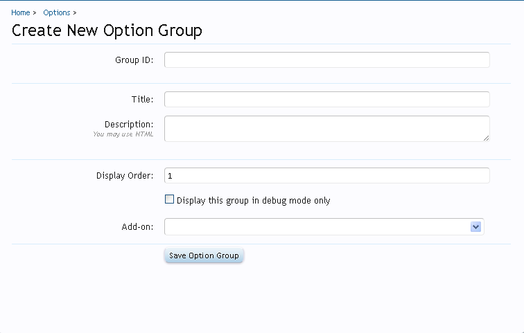
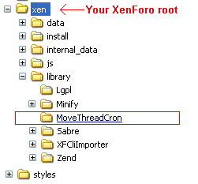

### How to create a Cron Entry to move threads (with options)
###### 2012-02-07 13:25

This tutorial was made based on this [thread](http://xenforo.com/community/threads/creating-a-cron-to-move-threads-with-a-certain-prefix-to-another-forum.27305).

I will teach how to create a new cron entry to move all threads with a specified prefix from forum X to forum Y and run it once a day.

### Step 1 - Creating the Add-on

First we need to create a new add-on. This is a very simple step. To be able to create you need to be in Debug Mode. You can see how to put your forum in Debug Mode in [this link](http://xenforo.com/community/threads/frequently-asked-questions.5183/#post-248490)

To create a new add-on go to **AdminCP -> Home -> List Add-ons** and click in the button **Create Add-on**. In the following screen you need to fill those fields to create the add-on. Use the info below:

- **Add-on ID**: MoveThreadsCron
- **Title**: Cron to Move Threads Automatically
- **Add-on is active**: Checked
- **Version String**: 1.0.0
- **Version ID**: 1

And the rest of the fields just let in blank. We do not need to fill. This add-on is just simple add-on, so we dont have any installation process or something.

Click Save Add-on and your add-on is created!

### Step 2 - Defining the Options

Let's create some options to make our add-on a little more customizable. What we will do here is create a cron entrey to move threads with a specific prefix inside a specifc forum to another specifc forum. Hell yeah, it is a bunch of specifc things, I know. So, instead of specify all those info inside the php file of our cron, let's create options for that.

To create an option, we first need to create a group option for our addon, so go to **AdminCp -> Options** and click in the **+Add Option Group** button. This will bring to you a new page:



Use the information bellow to fill the required fields. We are creating a new option group to hold all our options for this add-on.

- **Group ID**: MoveThreadCron
- **Title**: Cron to Move Threads Automatically
- **Description**: Options to the addon Cron to Move Threads Automatically.
- **Display Order**: It is your choice, but I always use: 1000000
- **Display this group in debug mode only**: NOT checked
- **Add-on**: Cron to Move Threads Automatically

After that, we are now able to create new options. All the new options will be placed inside this recetly created option group. If you've followed my steps, you should be in this page:


To add a new option, click in the **+Add Option** button.

This first option will hold the forum id that we want to get threads from. Follow the info below to fill the required fields.

#### Option 1

- **Option ID**: mtcFromForum
- **Add-on**: Cron to Move Threads Automatically
- **Title**: Forum to get threads
- **Explanation**: Insert the Forum ID of the forum you want to get threads from.
- **Edit Format**: SpinBox
- **Format Parameters**: Min = 1
- **Data Type**: Unsigned Integer
- ... some other fields in the middle, just let they in blank ...
- **Cron to Move Threads Automatically**: Checked, value = 10

#### Option 2

- **Option ID**: mtcFromPrefix
- **Add-on**: Cron to Move Threads Automatically
- **Title**: Get Threads with this prefix
- **Explanation**: Insert the Prefix ID of the prefix you want to get threads. The cron will only take ALL threads that have this specific prefix.
- **Edit Format**: SpinBox
- **Format Parameters**: Min = 1
- **Data Type**: Unsigned Integer
- ... some other fields in the middle, just let they in blank ...
- **Cron to Move Threads Automatically**: Checked, value = 20

#### Option 3

- **Option ID**: mtcToForum
- **Add-on**: Cron to Move Threads Automatically
- **Title**: Destination Forum
- **Explanation**: Insert the ID of the forum that we will move threads to. This is the destination forum of the threads.
- **Edit Format**: SpinBox
- **Format Parameters**: Min = 1
- **Data Type**: Unsigned Integer
- ... some other fields in the middle, just let they in blank ...
- **Cron to Move Threads Automatically**: Checked, value = 30

#### Option 4

- **Option ID**: mtcToPrefix
- **Add-on**: Cron to Move Threads Automatically
- **Title**: Destination Prefix
- **Explanation**: Insert the ID of the prefix that we will set to the moved threads.
- **Edit Format**: SpinBox
- **Format Parameters**: Min = 1
- **Data Type**: Unsigned Integer
- ... some other fields in the middle, just let they in blank ...
- **Cron to Move Threads Automatically**: Checked, value = 40

#### Option 5

- **Option ID**: mtcAmmount
- **Add-on**: Cron to Move Threads Automatically
- **Title**: Ammount of Threads
- **Explanation**: This is the ammount of threads that the cron job will look to move to the destination forum.
- **Edit Format**: SpinBox
- **Format Parameters**: Min = 1
- **Data Type**: Unsigned Integer
- ... some other fields in the middle, just let they in blank ...
- **Cron to Move Threads Automatically**: Checked, value = 50

After all that, you should end up with this:


As you see each one of the options is self explanatory. It is important to fill the Explanation field correctly so we will now what this option is for. Since we're in the right place, fill all these options with what you want. It is important too to fill all them correctly.

But where do I get the Prefix or Forum ID?

Go get the forum ID you go to **AdminCP -> Applications -> Display Node Tree** and click on the forum to select. Take a look at your URL. It should be something like this:

    http://example/example/admin.php?nodes/main-forum.2/edit

The number 2 is your forum ID.

The same you can do with thread prefixes.

Go to **AdminCP -> Applications -> Thread Prefixes** and click on the prefix to select. Take a look at your URL. It should be something like this:

    http://example/example/admin.php?thread-prefixes/videos.1/edit

The number 1 is your prefix ID.

### Step 3 - Coding! (It was about time!)

Now that we setup all that we have to make this add-on work, it is only missing the cron entry code (most important, I guess).

So, let's do it!

Go to your XenForo root and find the folder library. Inside of it you will need to create a new folder, the folder for our add-on. Rename the folder to the name of our addon `MoveThreadCron`. You'll end up with this:



Inside the new folder, create a new file called CronEntry.php. Open this file and put the following code (copy and past to an editor and take a look at the comments, it is very usefull):

```php
<?php
/**
* Cron entry of the tutorial How to create a Cron Entry to move threads (with options!).
*
* MoveThreadCron = Name of our folder (and add-on too!)
* CronEntry = name of this file!
*
*/
class MoveThreadCron_CronEntry
{
    /**
    * Move ammount of threads with a specified prefix from forum X to forum Y.
    */
    public static function runMoveThreads()
    {
        /* We have options, remember? So, we will just get all options using the line bellow. */
        $options = XenForo_Application::get('options');

        /*
        *
        * Since we already have created the options, we just have to get them and use it in our cron.
        * Let's put all our custom options in an array, so can be easy to use it before in the function.
        * If you don't remember the Options ID, just go back to Step 2 and see.
        *
        */
        $cronOptions = array(
            'fromForum'  => $options->mtcFromForum,
            'toForum'    => $options->mtcToForum,
            'fromPrefix' => $options->mtcFromPrefix,
            'toPrefix'   => $options->mtcToPrefix,
            'ammount'    => $options->mtcAmmount
        );

        /*
        *
        * To get the thrads we want, we must use a model. There is some ways to create models, but since we are in a static class
        * we will use the above method. The model is the XenForo_Model_Threads which has various functions to interact with threads.
        * The file of this model is located at: library/XenForo/Model/Thread.php. You can take a look at there if you want.
        *
        */
        $threadModel = XenForo_Model::create('XenForo_Model_Thread');

        /*
        *
        * Now we have our model, we can use a method inside of it to get threads from a forum. But what method?
        * This model has the method getThreads() which we can use conditionals and/or options to get threads.
        * So this will be the method that we'll use. First of all let's declare the conditionals variable so we can
        * filter the results and get only certain specific threads based on our options.
        *
        */
        $conditionals = array(
            // we just want to get threads from one forum. This is set in the options
            'forum_id'    => $cronOptions['fromForum'],

            // same thing, we want only threads with a certain prefix id
            'prefix_id' => $cronOptions['fromPrefix']
        );

        /*
        * Now let's just set the option to fetch the threads. The only option to fetch that we have to use is the "ammount of threads".
        * This will limit the number of returned threads.
        */
        $fetchOptions = array(
            // only get this ammount of threads, please!
            'limit' => $cronOptions ['ammount']
        );

        /*
        * Now, let's get those threads!
        */
        $threads = $threadModel->getThreads($conditionals, $fetchOptions);

        /* If the method return any threads, let's move them to the destination forum! */
        if ($threads)
        {
            /* Now, for each thread found, let's change the prefix and move the thread to the destination forum! */
            foreach ($threads as $thread)
            {
                /*
                * To move threads, we need to change a field in the database. To do that, we've always to use (almost always) the DataWriter.
                * The DataWriter will do almost all the job for us. We just need to create it.
                */
                /* Let's create the DataWriter associated on Threads */
                $dw = XenForo_DataWriter::create('XenForo_DataWriter_Discussion_Thread');

                /* Associate the data that we have in the thread to the DataWriter instance */
                $dw->setExistingData($thread);

                /* Here it is the code to move this thread to the destination forum. Simple, eh?
                * We are just changing the ID of the NODE of this thread to the new ID, which is the destination forum ID
                */
                $dw->set('node_id', $cronOptions['toForum']);

                /* Now, let's change the prefix id. We already have the destination prefix set in the options, so let's use it. */
                $dw->set('prefix_id', $cronOptions['toPrefix']);

                /* Save all changes and we are done! */
                $dw->save();
            }
        }
    }
}
?>
```

(Almost all the lines from the file is explained, so I'll not explain in here)

#### Step 4 - Insert a new Cron Entry

Its about to finish. Now we need to Create a New Cron Entry, so XenForo will now that we have a new task to run!

Go to **AdminCP -> Tools -> Cron Entries** and click in the **+Create New Cron Entry**.

Fill the fields with the following info:

- **Cron Entry ID**: MoveThreadCronEntry
- **Title**: Cron to Move Threads Automatically
- **Cron Callback**: MoveThreadCron_CronEntry::runMoveThreads
- **Run on type of day**: This is your choice.
- **Allow cron entry to run automatically when scheduled**: Checked
- **Add-on**: Cron to Move Threads Automatically

That's it. Click in **Save Cron Entry** button.

You can test the Cron by selecting the menu Controls of the Cron and hit "Run".

That's it. If you followed all the steps as described in this tutorial, your addon should get working. You can also use imagination to insert more options. Something like "Move the Thread and then set a default title". There is a bunch of things you can do.


